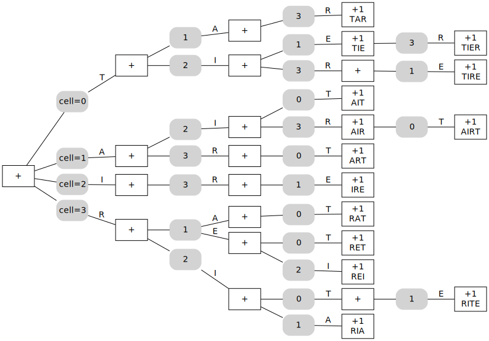
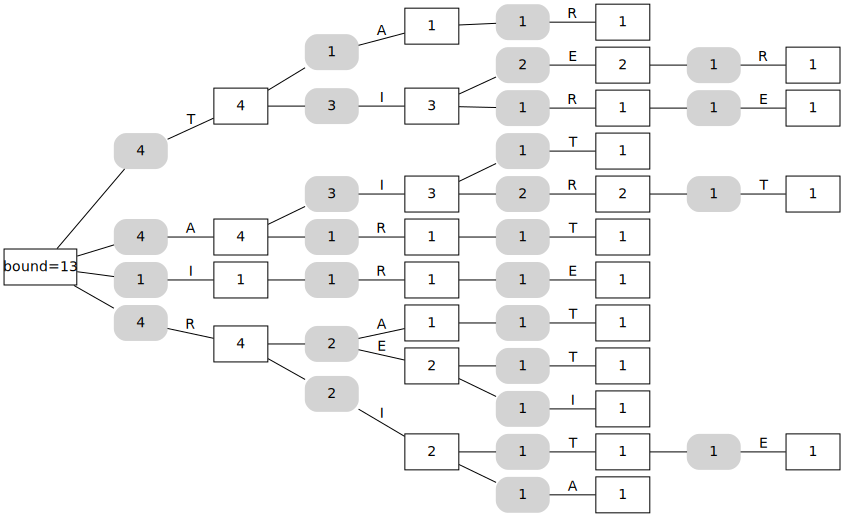
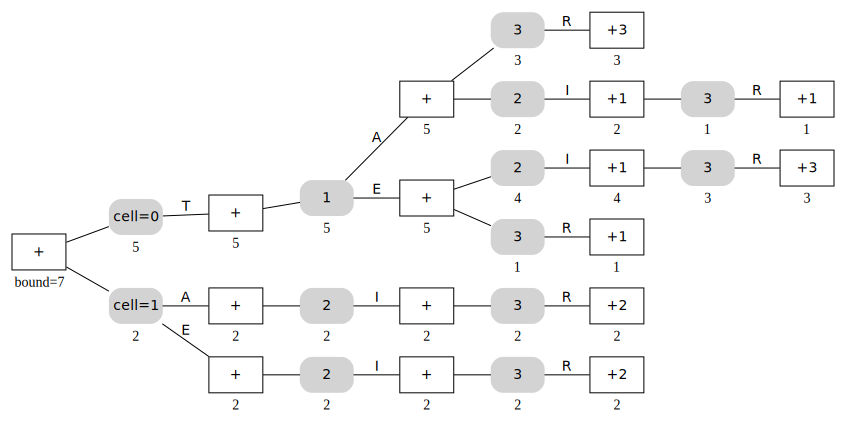

# A Computational Proof of the Highest-Scoring Boggle Board

⚠️ ⚠️ ⚠️

_This is an in-progress draft of a paper explaining the methodology used by this repo. For a very high-level explanation and links to blog posts, see [Methodology] on the GitHub repo._

⚠️ ⚠️ ⚠️

[Methodology]: https://github.com/danvk/hybrid-boggle?tab=readme-ov-file#methodology

## Abstract

- TODO

## Introduction

- What is Boggle? How do you play?
- Prior art
- Preview of our results

## Terminology and Conventions

The words that can be found on a Boggle board are determined by the letters on the board and by the choice of dictionary. In this paper, we’ll use the ENABLE2K word list, which was developed by Alan Beale in 1997 and 2000. This word list contains 173,528 entries.

We adopt the following terminology and conventions:

- `B` refers to a Boggle board. To refer to a specific Boggle board, we write the out the letters of the board in column-major order. (This distinction is only important for non-square dimensions such as 2x3 and 3x4 Boggle, which lack reflectional symmetry.)
- Because one of the Boggle dice contains a “Qu” (two letters), we adopt the convention that `q` indicates a Qu cell. So `qaicdrneetasnnil` refers to the board in Figure N.
- TODO: say something about lowercase vs. uppercase (no meaningful distinction)
- The cells on an MxN board are numbered `0…M*N-1` in column-major order, as shown in Figure N. We refer to the letter on cell `i` of board `B` as `B_i`.
- `Words(B)` is the set of all words that can be found on the board `B`.
- `Score(B)` is the sum of the point value of these words, `\sum_{w \in Words(B)} Points(Length(w))`. We refer to this as the score of the board.

## Heuristics to find high-scoring boards

Finding all the words on a Boggle board is a popular programming puzzle. This is done by performing a depth-first search over the board’s adjacency graph starting at each cell. The key to making this efficient is to prune out prefixes such as “bnj” that don’t begin any words in the dictionary. This is typically done using a Trie (Prefix Tree) data structure.

```python
# Listing 0: Scoring a Boggle Board
def score(board: str, trie: Trie) -> int:
    score = 0
    for i in range(m * n):
        score += score_dfs(board, i, trie, {})
    return score

def score_dfs(board: str, idx: int, parent_node: Trie, used) -> int:
    score = 0
    used[idx] = True
    if parent_node.has_child(board[idx]):
        trie_node = parent_node.child(board[idx])
        if trie_node.is_word() and not trie_node.is_visited():
            score += SCORES[trie_node.length()]
            trie_node.set_visited()
        for n_idx in NEIGHBORS[idx]:
            if not used.get(n_idx):
                score += score_dfs(board, n_idx, trie_node, used)
    used[idx] = False
    return score
```

With some care, it is possible to find the score of individual boards extremely rapidly on modern hardware. For example, the author’s laptop is able to score random 4x4 Boggle boards at a rate of around 200,000 boards per second.

This speed can be used to attack a new problem: finding high-scoring boards. This is typically done via local search heuristics such as hillclimbing, simulated annealing, or genetic algorithms. A particularly effective approach for Boggle is to iteratively explore around a pool of high-scoring boards, as shown in Listing 1.

```
# Listing 1: Hillclimbing Algorithm
N = 250  # pool size
Pool <- N random Boggle Boards
Repeat until convergence:
  Neighborhood <- Pool + Boards within edit distance 1 of a board in Pool
  Pool <- N highest-scoring boards in Neighborhood
```

We take an “edit” to mean changing one letter or swapping two letters. With a pool size of N=500, this usually (95/100 times) converges with the highest-scoring board as `perslatgsineters`, which contains 1,045 words and scores 3,625 points using ENABLE2K.

This makes one wonder whether this board is, in fact, the global optimum. The principal result of this paper is to show that it is.

## Proof of Maximality

The most straightforward way to prove that a board is the highest-scoring is by exhaustive search. Unfortunately, the combinatorial explosion of possible boards renders this infeasible for all but the smallest sizes:

| **Dimensions** | **Number of Boards (approx)** | **Evaluate Rate** | **Total Time** |
| --- | --- | --- | --- |
| 3x3 | 26^9/8 ≈ 6.8e11 | 600k bd/s | ~12 days |
| 3x4 | 26^12/4 ≈ 2.4e16 | 400k bd/s | ~2000 years |
| 4x4 | 26^16/8 ≈ 5.5e21 | 200k bd/s | ~900M years |

One objection is that not all 26^16 combinations of letters can be rolled with the standard 16 Boggle dice. Determining whether a particular letter combination can be rolled is a Set-Cover problem, which is NP-Complete. A greedy approach works well for this small problem, however, and we can estimate that approximately 1 in 12 combinations of letters can be rolled. While this reduces the search space, it’s not enough to make exhaustive search feasible, and this will not prove to be a useful constraint.

Two observations suggest a path towards a solution:

1. Similar boards have similar sets of words on them. Finding the score of a board and that of its neighbors involves large amounts of duplicated work.
2. Most boards have scores that are significantly lower than the best one. The average score of a random board is about 42, nearly 100x less than 3625. (The average score of a board rolled with Boggle dice is closer to 120.)

The former observation suggests that we should group boards together to reduce repeated work. The latter indicates that we have considerable “wiggle room” to upper bound the score rather than calculate it precisely.

### Branch and Bound

Rather than exhaustive search, we use Branch and Bound to find the globally optimal board. Branch and Bound is an algorithm design paradigm dating back to the 1960s that narrows in on the global optimum by recursively subdividing the search space.

To apply it, we need to define two operations on sets of Boggle boards:

- bound(S): an upper bound on the score of any board in a set of boards S
- branch(S): a way to split the set S into smaller sets S_1, S_2, …, S_m.

With these operations in place, the Branch and Bound algorithm to find all boards with a score greater than S_high is given in Listing 2:

```
# Listing 2 - Branch and Bound Algorithm
Queue <- {Universal Set of MxN Boggle Boards}
while Queue is non-empty:
  S <- Pop(Queue)
  if |S| == 1:
    S is a candidate solution; score its lone board to check
  else if bound(S) < S_high:
    S cannot contain a high-scoring board; it can be dropped.
  else:
    for S_i in branch(S):
      Queue <- S_i
```

The appeal of this approach is that, when `bound(S)` is low, we can discard the entire set `S` without having to evaluate every board in that set. Now we need to define the branch and bound operations.

### Board classes and the branch operation

Rather than allowing arbitrary sets of Boggle boards, we restrict ourselves to “board classes.” These require each cell of a board in the set to come from a particular set of letters:

- `C(L1, L2, …, L_mxn) = { B | B_i \in L_i \forall i }`

For example, here’s a 3x3 board class where each cell can be one of two letters:

| {A,B} | {G,H} | {M,N} |
| --- | --- | --- |
| {C,D} | {I,J} | {O,P} |
| {E,F} | {K,L} | {Qu,R} |

This board class contains 2^9 = 512 possible boards. Here are a few of them:

| A | G | M |
| --- | --- | --- |
| D | I | P |
| E | L | R |

*agmdipelr: 85 points*

| B | H | M |
| --- | --- | --- |
| C | I | P |
| E | L | R |

*bhmcipelr: 62 points*

| B | H | M |
| --- | --- | --- |
| D | J | P |
| F | K | Qu |

*bhmdjpfkq: 0 points*

Analogous to the `B_i` notation for boards, we can indicate the possible letters on a cell in a board class as `C_i`. On this board class, for example, `C_0 = {"A", "B"}`.

We can carve the 26 letters of the alphabet up into distinct “buckets” to reduce the combinatorial explosion of possible boards into a much smaller number of board classes.

The following partitions of the alphabet were found via a heuristic search:

| **N** | **Letter Buckets** |
| --- | --- |
| 2 | {aeiosuy, bcdfghjklmnpqrtvwxz} |
| 3 | {aeijou, bcdfgmpqvwxz, hklnrsty} |
| 4 | {aeiou, bdfgjqvwxz, lnrsy, chkmpt} |

Using three buckets with 4x4 Boggle, for example, we have only 3^16 / 8 ≈ 5.4e6 board classes to consider, a dramatic reduction from the 5.5e21 individual boards. Of course, this will be in vain if operations on board classes are proportionally slower. Fortunately, this will not prove to be the case.

To “branch” from a board class, we split one of its cells into the individual possibilities. For example, starting with this board class containing 5,062,500 boards:

| lnrsy | chkmpt | lnrsy |
| --- | --- | --- |
| aeiou | aeiou | aeiou |
| chkmpt | lnrsy | bdfgjqvwxz |

we might split the middle cell to get five board classes containing 1,012,500 boards each:

| lnrsy | chkmpt | lnrsy |
| --- | --- | --- |
| aeiou | a | aeiou |
| chkmpt | lnrsy | bdfgjqvwxz |

| lnrsy | chkmpt | lnrsy |
| --- | --- | --- |
| aeiou | e | aeiou |
| chkmpt | lnrsy | bdfgjqvwxz |

…

| lnrsy | chkmpt | lnrsy |
| --- | --- | --- |
| aeiou | u | aeiou |
| chkmpt | lnrsy | bdfgjqvwxz |

Since the center and edge cells have the greatest connectivity, we split these first before splitting the corners.

Board classes still have all the same symmetries as a Boggle board. This allows us to only consider “canonically-oriented” board classes for a roughly 8x reduction in the search space.

### The sum bound

Next we need to construct an upper bound. One possible bound is the score of every word that can appear on any board in the board class.

- `sum_bound(C) = \sum_{unique words on any board B \in C} SCORE[word]`

This can be calculated in a similar manner to an ordinary Boggle solver, except that we need two loops now: one for neighbors, and a new one for each possible letter on each cell:

```
# Listing 1: Calcluating sum bound on a Boggle board class
def sum_bound(board_class: list[str], trie: Trie) -> int:
    score = 0
    for i in range(m * n):
        score += sum_bound_dfs(board_class, i, trie, {})
    return score

def sum_bound_dfs(board_class: list[str], idx: int, parent_node: Trie, used) -> int:
    score = 0
    used[idx] = True
    letters = board_class[idx]
    for letter in letters:
        if parent_node.has_child(letter):
            trie_node = parent_node.child(letter)
            if trie_node.is_word() and not trie_node.is_visited():
                score += SCORES[trie_node.length()]
                trie_node.set_visited()
            for n_idx in NEIGHBORS[idx]:
                if not used.get(n_idx):
                    score += sum_bound_dfs(board_class, n_idx, trie_node, used)
    used[idx] = False
    return score
```

Clearly we have `sum_bound(C) >= Score(B) \forall B \in C` because every word on every possible board contributes to the bound.

A useful property of this bound is that, if `|C| = 1`, then `sum_bound(C) = max(Score(B) \forall B in C)`, that is to say, it converges on the true Boggle score.

Unfortunately, this bound is imprecise because it doesn’t take into account that some letter choices are mutually exclusive. For example, consider this 2x2 board class containing two individual boards:

| F | {A, U} |
| --- | --- |
| . | R |

There are two words here, “far” and “fur.” These each count for 1 point, so the sum bound of the board class is 2. No individual board can contain both of these words, however, since the A and the U are mutually exclusive.

This proves problematic for large board classes. For example, the sum_bound of the 5,062,500 board class above is 109,524 points, but the best board in that class only scores 545 points. To get a better bound, we need to take into account that choices on cells are exclusive.

### The max bound

We can model this by taking the the max across the letter possibilities on a cell instead of the sum. In doing so, we dispense with any attempt to enforce the constraint that a word can only be found once.

```
# Listing 2: Calcluating max bound on a Boggle board class
def max_bound(board_class: str, trie: Trie) -> int:
    bound = 0
    for i in range(m * n):
        bound += max_bound_dfs(board_class, i, trie, {})
    return bound

def max_bound_dfs(board_class: str, idx: int, parent_node: Trie, used) -> int:
    max_score = 0
    used[idx] = True
    letters = board_class[idx]
    for letter in letters:
        if parent_node.has_child(letter):
            letter_score = 0
            trie_node = parent_node.child(letter)
            if trie_node.is_word():
                letter_score += SCORES[trie_node.length()]
            for n_idx in NEIGHBORS[idx]:
                if not used.get(n_idx):
                    letter_score += max_bound_dfs(board_class, n_idx, trie_node, used)
            max_score = max(max_score, letter_score)
    used[idx] = False
    return max_score
```

We can see that this is a valid bound because, for any particular board `B` in a class `C`:

1. It produces the full set of recursive calls for `B` from Listing 0, as well as many other calls.
2. For each of these matching calls, `max_bound_dfs` returns a score greater than or equal to `score_dfs`. This could be either because there’s another letter choice that produces a higher score, or because `max_bound_dfs` double-counts a word that `score_dfs` does not.

So `max_bound(C) >= score(B) \forall B \in C`. In practice, this bound is considerably tighter than the sum bound (see Table N). However, because it double-counts words, the max bound for a board class containing a single board may be greater than the score of that board. (This can only happen if the board contains a repeated letter.)

For example, here are the sum and max bounds for the 5,062,500 board 3x3 class and each of its five splits:

| **Center Cell** | **Sum Bound** | **Max Bound** | **True Max** |
| --- | --- | --- | --- |
| aeiou | 109,524 | 9,460 | 545 |
| a | 56,576 | 6,120 | 545 |
| e | 72,026 | 7,023 | 520 |
| i | 60,244 | 6,231 | 503 |
| o | 49,533 | 5,525 | 392 |
| u | 38,214 | 4,464 | 326 |

The max bound is an order of magnitude tighter than the sum bound in all cases. It’s still imprecise, however, because it might choose different letters for a cell along different search paths in the DFS. Consider this 2x2 board class:

| T | I |
| --- | --- |
| {A, E} | R |

Starting with the “T:”

- If we go down, we can form “TAR” by picking the “A” but we cannot form any words if we pick the “E.” So the “T” → {A, E} path in the `max_bound` DFS nets 1 point.
- If we go right to “I”, we can only score points by picking the “E” for this cell to form “TIE” and “TIER.” So the “T” → “I” → {A, E} path nets 2 points.

The points from these two paths are added. But no single board can have both an “A” and an “E” on the bottom left cell, so neither board in this class contains both “TAR” and “TIE.” This is why the max bound is imprecise. It enforces that we make a choice on each cell, but not that this choice be consistent across all paths through that cell.

The minimum of two upper bounds is also an upper bound, so we can also use:

```
max_sum_bound(C) = min(max_bound(C), sum_bound(C))
```

as an upper bound that combines the strengths of both. These bounds can be calculated simultaneously in a single DFS.

### Initial Results with Branch and Bound

Using the Branch and Bound algorithm with board classes and `max_sum_bound` results in a dramatic speedup over exhaustive search. For 3x3 Boggle using three buckets on the author’s laptop, the search completes in about an hour on a single CPU core. This represents roughly a 300x speedup. The highest-scoring 3x3 boards found via Branch & Bound precisely match those found via hillclimbing.

| S | T | R |
| --- | --- | --- |
| E | A | E |
| D | L | P |

*The highest-scoring 3x3 board, with 545 points. Long words include “repasted” and “replated.”*

This speedup makes 3x3 Boggle maximization easy on a laptop and 3x4 maximization possible in a data center. But it offers little hope for 4x4 Boggle.

Despite the speedup, there remains an enormous amount of repeated work. Each evaluation of `max_sum_bound` is performed independently, but the computation for `max_sum_bound(C)` and its children after the “branch” operation (`max_sum_bound(C1)`, `max_sum_bound(C2)`, …) is nearly identical. To achieve a greater speedup, we’ll seek to eliminate this repetition.

## Sum/Choice trees

Our goal is to speed up repeated branch and bound calculations. To do so, we’ll forget about `sum_bound`, whose global uniqueness is difficult to maintain. Instead, we’ll focus solely on `max_bound`, which can be be more easily calculated using local information.

Previously `max_bound` was calculated using recursive function calls. Our next step is to convert these function calls into a tree structure in memory. This will allow us to implement branch and bound as operations on the tree.

First, we refactor `max_bound` to use two functions. These will become two types of nodes in our tree:

```
# Listing 3: Calculating max bound with two mutally recursive functions
def max_bound(board_class: str, trie: Trie) -> int:
    bound = 0
    for i in range(m * n):
        bound += choice_step(board_class, i, trie, {})
    return bound

def choice_step(board_class, idx, parent_node, used):
    max_score = 0
    used[idx] = True
    letters = board_class[idx]
    for letter in letters:
        if parent_node.has_child(letter):
            max_score = max(
                max_score,
                sum_step(board_class, idx, parent_node.child(letter), used),
            )
    used[idx] = False
    return max_score

def sum_step(board_class, idx, trie_node, used):
    score = 0
    if trie_node.is_word():
        score += SCORES[trie_node.length()]
    for n_idx in NEIGHBORS[idx]:
        if not used.get(n_idx):
            score += choice_step(board_class, n_idx, trie_node, used)
    return score
```

This is a simple transformation of the previous `max_bound`. With this new formulation, we construct a tree where each node corresponds to one of the function calls:

```
Node := SumNode | ChoiceNode

ChoiceNode:
  cell: int
  children: {letter -> SumNode}

SumNode:
  points: int
  children: ChoiceNode[]
```

The top-level call to `max_bound` can be modeled as a `SumNode` with each cell as a child:

```
BuildTree(C) -> SumNode
```

The bound for each node can be computed as:

```
Bound(n: SumNode) = n.points + sum(Bound(c) for c in n.children)
Bound(n: ChoiceNode) = max(Bound(c) for c in n.children)
```

TODO: note that this generates a lot of dead paths? Might only be worth mentioning if I include the code listing.

In practice, the bound can be stored explicitly on each node and updated as we modify the tree. Here’s what one of these trees looks like for the TAR/TIER board from earlier:

| cell 0: T | cell 2: I |
| --- | --- |
| cell 1: {A, E} | cell 3: R |



*Tree for the TAR/TIER board class. ChoiceNodes are round, SumNodes are rectangular. Choices of letters on ChoiceNodes are indicated along edges. Some of these words (AIT, AIRT, REI, RET) are obscure, but are valid Boggle plays.*

Here’s the same tree showing the bound on each node:



We can make a few observations about these Sum/Choice trees:

- By construction, `Bound(BuildTree(C)) = max_bound(C)`.
- The wordlist and geometry of the Boggle board are fully encoded in the tree. Once the tree is constructed, we no longer need to reference the Trie or the `NEIGHBORS` array.
- Words correspond to `SumNode`s with points on them.
- Individual words can be read off by descending the tree and tracking the letters used on each `ChoiceNode`.
- `ChoiceNode`s for the same cell may appear multiple times in the tree. The bound is imprecise because the `max` operation may not make the same choice on each `ChoiceNode`.

### Multiboggle and the Invariant

We’ve seen that the root bound on the tree is an alternate way to calculate `max_bound` for a board class. Now we want to perform operations on these trees, and these operations may affect the bound. To prove that the bound remains valid, we’ll establish an invariant that implies the validity of the bound. Then we’ll show that each operation maintains this invariant.

First, we define the “Force” operation on a tree:

```
Force(n: SumNode, B) = n.points + sum(Force(c, B) for c in n.children)
Force(n: ChoiceNode, B) = Force(n.choices[B_{n.cell}], B) or 0
```

Intuitively, this “forces” each cell to match the board `B`.

- Lemma: `F(BuildTree(C), B) <= Bound(BuildTree(C)) \forall B \in C`

This is immediate from the definition. Force is the same as Bound on Sum nodes, and less than or equal to Bound on Choice nodes.

So what is `Force(BuildTree(C), B)`? We can write out code to calculate this by modifying Listing 3:

```
# Listing 4: Build+Force operation on Tree
def forced_tree(board_class, board, trie):
    bound = 0
    for i in range(m * n):
        bound += choice_step(board_class, board, i, trie, {})
    return bound

def choice_step(board_class, board, idx, parent_node, used):
    score = 0
    used[idx] = True
    letter = board[idx]
    if parent_node.has_child(letter):
        score = sum_step(board_class, board, idx, parent_node.child(letter), used)
    used[idx] = False
    return score

def sum_step(board_class, board, idx, trie_node, used):
    score = 0
    if trie_node.is_word():
        score += SCORES[trie_node.length()]
    for n_idx in NEIGHBORS[idx]:
        if not used.get(n_idx):
            score += choice_step(board_class, board, n_idx, trie_node, used)
    return score
```

We can make a few immediate observations:

1. `Force(BuildTree(C), B)` does not depend on the board class `C`. It is a function of `B` alone.
2. `Force(BuildTree(C), B)` performs the exact same calculation as `Score(B)`, except that there are no checks for whether a word has been found more than once.

We’ll refer to this as `Multi(B)`, the “Multiboggle score” of `B`. This can be thought of as a variation on Boggle where you’re allowed to find the same word multiple times. For example, this 2x3 Boggle board:

```
E B E
E F E
```

Has `Score(B) = 3` (”bee”, “fee”, “beef”) but `Multi(B) = 12` because each word can be found along four distinct paths.

- Lemma: `Multi(B) >= Score(B)`. This is clear from the definition. The Multiboggle score is an upper bound on the Boggle score.
- Lemma: `Multi(B) = Score(B)` if `B` does not contain repeated letters. (The converse is not true.)
- Lemma: `max_bound({B}) = Multi(B)`.

In other words, the `max_bound` converges to the Multiboggle score as you progressively force cells on a board class.

Putting this together, if `T=BuildTree(C)` then we have:

```
 Score(B) <= Multi(B)
           = Force(T, B)
          <= Bound(T) \forall B \in C
```

So if we can show that `Force(T, B) = Multi(B)` for all boards in a board class, then `Bound(T)` is a valid upper bound for `Score(C)`.

For most boards, `Multi(B)` is close to `Board(B)`. Since we have considerable “wiggle room” between the average score of a board (~40 points) and the score of the best board (3625), working with the Multiboggle score is an acceptable concession. What we’ll seek is boards `B` with `Multi(B) >= S_high`. For each of these, we can confirm whether `Score(B) >= S_high` as well using a regular Boggle solver.

While `Multi(B)` is usually close to `Score(B)`, there are some pathological cases where this breaks down. For example, the board in Figure N has `Score(B) = 189`, but `Multi(B) = 21953`! (The word “reservers” can be found in 100 distinct ways.) We will partially address this issue later in the paper.

| E | E | E | S |
| --- | --- | --- | --- |
| R | V | R | R |
| E | E | E | S |
| R | S | R | S |

### Sum/Choice Satisfiability is NP-Hard

We seek boards `B` in a board class `C` such that `Force(T, B) >= S_high`. Since each board in a board class represents a choice of letter on each of the MxN cells, we can think of this as a satisfiability problem.

- Theorem: Determining whether there exists `B` such that `Force(T, B) >= S_high` is NP-Hard.

Proof: We map from 3-CNF, a known NP-Hard problem, to the Sum/Choice Tree satisfiability problem.

Suppose we have a 3-CNF formula with `m` clauses on `x_1, x_2, ... x_n`.

For each clause, we construct a tree which evaluates to 1 if the clause is satisfied and zero if it is not satisfied.

- If the clause contains a single term `a`, then we model this as a ChoiceNode on cell `a`.
- If the clause is `a OR b`, we model is as a tree with two layers of `ChoiceNode`s.
- If the clause is `a OR b OR c`, we model it as a tree with three layers of `ChoiceNode`s.

Finally, we create a root `SumNode` `T` with the `m` `ChoiceNode`s as children. By construction, `\exists B s.t. Force(T, B) = m` iff there are `x_i` that satisfy the 3-SAT problem. So if we can solve the satisfiability problem for Sum/Choice trees, we can also solve it for 3-CNF. Since 3-CNF is known to be NP-Hard, this means that Sum/Choice satisfiability is NP-Hard as well.

(source: [D.W.’s mapping](https://stackoverflow.com/a/79413715/388951) on Stack Overflow)

So we should not expect to find an efficient solution to this problem, nor one that scales well to larger boards. This doesn’t necessarily mean that Boggle maximization itself is NP-Hard, since not every Sum/Choice tree corresponds to a Boggle board. Still, it is suggestive that this is a hard problem.

## Orderly Trees

Before defining operations on general Sum/Choice trees, it will be helpful to shift our perspective on them. So far, we’ve thought of them as tree representations of the recursive call structure of `max_bound`.

An alternative view, however, is to treat them as a container structure holding paths to words and the points associated with those words. Instead of forming the tree via DFS, we can find all the paths to words in the board class and add each of them to the tree structure.

We can define a path as a sequence of cells and letters on those cells:

```
Path p = list((cell, letter))
```

Then we can define `add_word`:

```python
# Listing 5: add_word to sum/choice tree
def add_word(node: SumNode, path: Path, points: int):
    if len(path) == 0:
        node.points += points
        return node

    cell, letter = path[0]
    choice_child = find(node.children, lambda c: c.cell == cell)
    if not choice_child:
        choice_child = ChoiceNode(cell=cell)
        node.children.append(choice_child)

    letter_child = choice_child.children.get(letter)
    if not letter_child:
        choice_child.children[letter] = letter_child = SumNode()

    return add_word(letter_child, path[1:], points)
```

- Lemma: This produces an identical tree.
    - Every path to points is present and identical in both constructions.

This shift in perspectives allows us to establish the critical result:

- Theorem: anagramming words before adding them preserves the invariant

This can be seen by treating the `Force` operation as a sum across all SumNodes with points in the tree, conditioned on whether the path to that node is realized in the board:

```
Force(T, B) = sum(node.points \forall node in T | Path(node)_i = B_i \forall i)
```

Then this is a natural consequence of `AND` being commutative.

TODO: tighten up the formalism around this

TODO: is this a better way to explain the invariant to begin with?

Previously, words were added to the tree in the order in which they were spelled. We can see now, however, that this was a choice. To get more consistent ordering and lower bounds, we can define a canonical order for the cells and sort the paths to words accordingly before adding them to the tree.

Any ordering is valid but, since center cells are likely to be used in the most words, it makes the most sense to put them at the top of the tree. For 4x4 Boggle, we use the following ordering (higher numbered cells appear closer to the root of the tree):

| 3 | 7 | 5 | 2 |
| --- | --- | --- | --- |
| 11 | 15 | 13 | 10 |
| 9 | 14 | 12 | 8 |
| 1 | 6 | 4 | 0 |

We can produce a tree using this canonical ordering using the following:

```
# Listing 6: Building an orderly tree
def build_orderly_tree(board_class, trie):
    root = SumNode()
    for i in range(m * n):
        choice_step(board_class, i, trie, [], root)
    return root

def choice_step(board_class, idx, trie_node, choices, root):
    letters = board_class[idx]
    for letter in letters:
        if trie_node.has_child(letter):
            choices.append((idx, letter))
            sum_step(board_class, idx, trie_node.child(letter), choices, root)
            choices.pop()

def sum_step(board_class, idx, trie_node, choices, root):
    if trie_node.is_word():
        ordered_choices = sorted(choices, key=lambda c: -ORDER[c[0]])
        score = SCORES[trie_node.length()]
        add_word(root, ordered_choices, score)
    for n_idx in NEIGHBORS[idx]:
        if n_idx not in (cell for cell, _letter in choices):
            choice_step(board_class, n_idx, trie_node, choices, root)
```

Because the cells follow a particular order and the resulting tree looks more “well-ordered,” we refer to these as Orderly Sum/Choice Trees or just “Orderly Trees.”

Using a canonical order for the cells naturally synchronizes choices across subtrees, particularly the choices with a low index (the center). This typically results in smaller trees with lower bounds, especially for large board classes.

Here’s the orderly tree for the TAR/TIER board class from earlier, ordered by cell number:



*Orderly Tree for “t ae i r”; Bound(node) is marked under each node.*

Note that the tree is smaller (29 vs. 56 nodes) and the bound on the root node has dropped from 13 to 7. Using an Orderly Tree helped for this small board class, but the effect is more dramatic for larger board classes:

| **Board** | **max_bound** | **Orderly bound** |
| --- | --- | --- |
| 2x2 | 13 | 7 |
| 3x3 (a) | 6,361 | 503 |
| 3x3 (b) | 9,460 | 1,523 |
| 3x4 (a) | 51,317 | 4,397 |
| 3x4 (b) | 194,425 | 10,018 |
| 3x4 (c) | 69,889 | 4,452 |
| 4x4 (a) | 176,937 | 11,576 |
| 4x4 (b) | 514,182 | 53,037 |

- 2x2 is `t ae i r`
- 3x3 (b) is the 5M board class from earlier in the paper (containing the best board)
- 3x4 (a) is board_id=27916 with three letter classes from [this sheet](https://docs.google.com/spreadsheets/d/1uG-KFJFdOS7MQcibcdloTtQEQAdwror6VA0BO0AhkYQ/edit?gid=1619399799#gid=1619399799)
- 3x4 (b) is board_id=234556 with 3 buckets, which contains best board perslatesind.
- 4x4 (b) is the best board’s class w/ three buckets
- 5x5 is the (possible) best board’s class w/ three buckets: 1,910,956 → 433,505
- 3x3 (a), 3x4 (c) and 4x4 (a) are classes for random boards, see [Log (post-PR)](https://www.notion.so/Log-post-PR-1f9d37156a098043860bf53c45c6a777?pvs=21) for June 6, 2025 for full commands.

By construction, no ChoiceNode `n` in an Orderly Tree will have `ORDER[n.cell]` greater than any of its parents. So if a path begins 14→6 in the tree, then it may only continue to cells 1 or 4, since those are higher numbers. (14→6→9 is a valid path, but it would be added to the tree as 14→9→6.) Intuitively, if cell `A` has a child on cell `B`, then this represents all the paths through the board that skip cells between `A` and `B` in the canonical order.

We can use this intuition to define `OrderlyTree(N)`:

```
Orderly(n: Int)
Orderly(0) = SumNode with no children
Orderly(N) = SumNode with children:
               OrderlyChoice(i)(cell=i)
               for i = 0 .. (N-1)

OrderlyChoice(n: Int)
Orderly(N) = ChoiceNode with Orderly(N) children
```

We can make a few more observations about Orderly Trees:

- The Orderly Tree for a board class, and hence the “orderly bound,” is dependent on the order of cells that we choose.
- We can no longer associate SumNodes with single words. For example, the “+3” node on the top right of the tree visualization includes the words TAR, RAT and ART. If you can find one of these, you can find all of them. (This is one reason that the Orderly Tree uses fewer nodes.) Enforcing that each word is only found once would be impossible in this context, since we’re not even sure which words we’ve found.

### OrderlyMerge

With Orderly Trees defined, we’re finally ready to perform operations on them. Our first goal will be to speed up the “branch” operation and calculation of the subsequent bound. This requires forcing a single cell in the board class to be each of its possible letters and constructing the resulting Orderly Tree.

In practice, it makes the most sense to force the top choice in the tree, i.e. the one with the first position in the canonical order. This is a “merge” operation on Orderly Trees, which is straightforward to implement as in Listing N.

```
# Listing 7: merge operation on orderly trees
# def merge(a: Orderly(N), b: Orderly(N)) -> Orderly(N):
def merge(a: SumNode, b: SumNode) -> SumNode:
    cell_to_child = {c.cell: c for c in a.children}
    for bc in b.children:
        ac = cell_to_child.get(bc.cell)
        cell_to_child[bc.cell] = merge_choice(ac, bc) if ac else bc
    children = sorted(cell_to_child.values(), key=lambda c: -ORDER[c.cell])
    return SumNode(points=a.points + b.points, children=children)

# def merge_choice(a: OrderlyChoice(N), b: OrderlyChoice(N)) -> OrderlyChoice(N):
def merge_choice(a: ChoiceNode, b: ChoiceNode) -> ChoiceNode:
    children = {**a.children}
    for choice, bc in b.children.items():
        ac = children.get(choice)
        children[choice] = merge(ac, bc) if ac else bc
    return ChoiceNode(cell=a.cell, children=children)
```

With the “merge” helper, we can define the “branch” operation:

TODO: this depends on the children being sorted, but this is never mentioned.

```
# Listing 8: branch operation on orderly trees
# def branch(o: Orderly(N)) -> list(Orderly(N-1)):
def branch(o: SumNode, top_cell: int, board_class: list[str]) -> list[SumNode]:
    top_choice = o.children[0]
    if top_choice.cell != top_cell:
        # edge case: the choice on the top cell is irrelevant, so o is Orderly(N-1).
        return [o for _letter in board_class[top_cell]]

    other_choices = o.children[1:]
    skip_tree = SumNode(children=other_choices, points=o.points)  # Orderly(N-1)
    return [
        merge(top_choice.children[letter], skip_tree)  # both are Orderly(N-1)
        if top_choice.children.get(letter)
        else skip_tree  # no words use this letter on the top choice cell
        for letter in board_class[top_cell]
    ]
```

- Lemma: Force(merge(T1, T2), B) = Force(T1, B) + Force(T2, B) \forall B \in T1 \union T2

The `branch` function splits the tree into two parts: one that includes the words that go through the “top” cell (`top_choice`) and another (`skip_tree`) that includes all the words that don’t. Each child of `top_choice` corresponds to a particular choice of letter on that cell. Every word must fall into one of these two groups (goes through the cell or doesn’t). Adding their bounds will produce a valid bound for this choice of letters. Since the `merge` operation preserves the invariant, the resulting tree will have a valid bound.

TODO: it might be helpful to define Force1, i.e. forcing just the top cell.

TODO: a visual would convey the intuition here, that “branch” is just a merge.

Calling `branch` is considerably faster than building a new tree for each letter choice on a cell. For example, on the high-scoring 4x4 board class from Table N, `branch` split a center cell containing 12 letters and returned 12 subtrees in 0.07s. Building the same trees from scratch took 4.0s, roughly a 60x difference.

A few observations:

- The `merge` operations perform a deep merge.
- In practice we can update `bound` on all nodes as we merge them.
- The bounds on the subtrees we get back from `branch` are exactly the same as what you’d get by building orderly trees for these smaller board classes directly. But the merge operations are considerably faster. TODO: this isn’t true, but why?
- The `merge` operation (and `branch`) are likely to reduce the bound because they synchronize choices across previously distinct subtrees.

Here are the results of the first `branch` call on the Orderly Tree for the 5 million board 3x3 board class from before.

| **Center Cell** | **Nodes** | **Bound** | **True Max** | **max_bound** |
| --- | --- | --- | --- | --- |
| aeiou | 333,492 | 1,523 | 545 | 9,460 |
| a | 86,420 | 1,198 | 545 | 6,120 |
| e | 98,585 | 1,417 | 520 | 7,023 |
| i | 81,062 | 994 | 503 | 6,231 |
| o | 75,474 | 862 | 392 | 5,525 |
| u | 60,457 | 753 | 326 | 4,464 |

### OrderlyBound

The `branch` operation on its own is sufficient to implement Branch and Bound with Orderly Trees. Merging allocates additional nodes, however, and we may wish to save RAM by not doing that all the way to each candidate board.

Instead, we can define an alternative algorithm, `OrderlyBound`, which refines the bound on a tree by traversing it, rather than merging subtrees. For each cell, we’ll maintain a stack of pointers to ChoiceNodes for that cell. To “branch,” we’ll pop off the ChoiceNodes for the next cell and, for each choice, push all the next child cells onto their stacks. We can maintain a bound as we do this. If the bound ever drops below `S_high`, we can abandon this search path.

```
# Listing 9: orderly_bound
# Assumes N >= 1
# def orderly_bound(root: Orderly(N), S_high: int):
def orderly_bound(root: SumNode, board_class: list[str], S_high: int):
    def step(
        points: int,
        idx: int,
        choices: list[char],  # letters chosen on previous cells
        stack: list[ChoiceNode],
    ):
        b = points + sum(bound(n) for n in stack)
        if b < S_high:
            return  # This board class has been eliminated
        if idx == N:
            # complete board that can't be eliminated
            record_candidate_board(choices, b)
            return

        # Try each letter on the next cell in the canonical order.
        cell = CELL_ORDER[idx]
        for letter in board_class[cell]:
            next_nodes = [n for n in stack if n.cell == cell]
            next_stack = [n for n in stack if n.cell != cell]
            next_points = points
            next_choices = choices + [letter]
            for node in next_nodes:
                letter_node = node.children.get(letter)
                if letter_node:
                    next_stack += letter_node.children
                    next_points += letter_node.points

            step(next_points, idx + 1, next_choices, next_stack)

    step(root.points, 0, [], root.children)
```

Lemma: Each `step` call preserves the invariant that `points + sum(Force(n, B) for n in stack) == Multi(B)` for all boards `B` compatible with `choices`.

Proof by induction:

- Base case:
    - The initial call to `step` has the root points, plus all the root’s children.
    - This matches the definition of `Force` for a `SumNode`.
- Inductive case:
    - For each board `B`, the call to `step` has `points + sum(Force(n, B) for n in stacks) == Multi(B)`.
    - For each next choice of letter, we replace each node from the stacks with its points and compatible children:

    ```python
    # stack: list[ChoiceNode]
    # letter: char
    next_points = points + sum(n.child[letter].points for n in stacks)
    next_stacks = [child for n in stacks for child in n.child[letter].children]

    next_points + sum(Force(n, B) for n in next_stacks)
    = next_points +
      sum(
        Force(child, B)
        for n in stacks
        for child in n.child[letter].children]
      )
    = points +
      sum(n.child[letter].points for n in stacks) +
      sum(
        Force(child, B)
        for n in stacks
        for child in n.child[letter].children]
      )
    = points + sum(
        (n.child[letter].points +
         sum(Force(child, B) for child in n.child[letter].children))
        for n in stacks
      )
    = points + sum(Force(n.child[letter], B) for n in stacks)
    = points + sum(Force(n, B) for n in stacks)  # defn of Force for ChoiceNode
    = Multi(B)
    ```


- Theorem: `OrderlyBound` finds all the boards `B` in a tree with `Multi(B) >= S_high`.

Proof: The lemma established an invariant for the recursive calls to `step`. It suffices to check the check the two cases where the function returns early.

If `bound < S_high`, then we have:

```
bound = points + sum(Bound(c) for stack in stacks for c in stack) < S_high
=> points + sum(Force(c, B) for stack in stacks for c in stack) < S_high \forall B
=> Multi(B) < s_high \forall B
```

and therefore there are no high-scoring boards.

If `idx==N`, then the stacks are empty and we have a single board:

```
bound = points + sum(Bound(c) for stack in stacks for c in stack)
      = points
      = Multi(B) >= S_high
```

So this is a candidate high-scoring board.

Observations:

- OrderlyBound performs a shallow merge.
- OrderlyBound stores at most one pointer to each node in the tree, but in practice many fewer.
- The `points` parameter to `step` is the Multiboggle score on the portion of the board that’s been forced.
- OrderlyBound has exponential backtracking behavior. We visit a node in `stack` something like 2^(# of skipped nodes).
- The `branch` operation (tree merging) mitigates this exponential by reducing the number of skips.

The `branch` and `OrderlyBound` operations work well together. In practice, we build the tree for a board class, then call `branch` some number of times before switching over to `OrderlyBound`. The optimal switchover point is highly variable, but switching when `root.bound <= 1.5*S_high` seems to work well in practice.

TODO: get some stats on number of `advance` calls, max number of cells in each stack.

TODO: get some stats about how fast OrderlyBound is vs. OrderlyMerge and how much memory they use.

### De-duplicated Multiboggle

`OrderlyBound` will report any board with `Multi(B) >= S_high`. For each of these, we need to check whether `Score(B) >= S_high` as well. As we saw earlier, these two scores are typically close, but there are some pathological cases where they diverge. Since `branch` and `OrderlyBound` converge on the Multiboggle score, they’ll bog down on the board classes containing these highly duplicative boards, and we’ll wind up having to score many millions of Boggle boards to filter them out.

We can improve the situation slightly. Consider the BEE/FEE/BEEF board from earlier:

```
E B E
E F E
```

The max bound counted each of these words four times. If we consider this in the context of a board class, however:

```
{E,X} B {E,X}
{E,X} F {E,X}
```

we can see that “BEE” can be found on the left only when both cells are E, not X, and similarly on the right. But when both of the left cells are E, we know that these paths to BEE, FEE and BEEF will only count once towards the true Boggle score. Both of the left paths to BEE:

```
E-B E    E B E
|        |/
E F E    E F E
```

correspond to the exact same SumNode in the orderly tree. So if we add this word’s points to that node once, rather than twice, we don’t risk compromising our upper bound.

We do still need to add both the left and the right versions of BEE, FEE and BEEF. If we only added the left versions, then we’d miss the points for this board in the board class:

```
X B E
X F E
```

And we’d no longer have a valid upper bound.

We can call this revised Multiboggle score `DeMulti(B)`. To calculate it, we only score words when they use a unique (unordered) set of cells. So for this board we have:

- `Score(B)` = 3
- `Multi(B)` = 12
- `DeMulti(B)` = 6

Clearly `Score(B) <= DeMulti(B) <= Multi(B)` for all boards B. For boards without repeated letters, `Score(B) = Multi(B)`, and so the same holds for `DeMulti(B)`.

We can filter out duplicate words in `BuildTree`. All the same invariants now hold, only we converge to `DeMulti(B)` rather than `Multi(B)`.

Here are some examples of the effect this deduping has on the root bound for Orderly Trees:

- eeesrvrreeesrsrs: 21953 → 13253 (true score is 189)
- 4x4 board class containing perslatgsineters: 53037 → 36881

Since the bound for this board class is so much lower, we expect the Branch and Bound procedure to process it much more quickly. In practice, this is close to a 5x speedup on this board class. This optimization has the greatest impact on the highest-scoring board classes, which take the greatest time to process.

### Final Branch and Bound Algorithm

Here’s the final Branch and Bound algorithm for finding Boggle boards `B` with `Score(B) >= S_high`:

1. Enumerate all possible board classes, filtering for symmetry.
2. For each board class `C`, build an Orderly Tree with deduping.
3. Repeatedly call `branch` until either:
    1. `node.bound < S_high` in which case this board class can be eliminated
    2. `node.bound <= 1.5 * S_high` in which case we switch to `OrderlyBound`. This will output a list of boards `B \in C` such that `MultiDedupe(B) >= S_high`.
4. For each such board `B`, check whether `Score(B) >= S_high`.

This will produce a list of all boards `B` (up to symmetry) with `Score(B) >= S_high`. If two congruent boards fall in the same board class, it will produce both of them.

## Results

The Branch and Bound procedure based on Orderly Trees runs significantly faster than the one based on `max_sum_bound`. For 3x3 Boggle with three letter buckets on a single core, the runtime goes from 1h → 2m, a 30x speedup.

This speedup is greater for larger board classes. Using two letter buckets instead of three reduces the runtime to just 70s. Compared to the 12 days it would have taken for exhaustive search, this represents a 15,000x speedup.

### Complete results for 3x4

Using two letter buckets in the four corners and three buckets for the other eight cells, the Branch and Bound procedure completed in 5h54m on a single core. This represents a 3,000,000x speedup compared to the 2,000 CPU years that exhaustive search would have required.

Using the ENABLE2K wordlist, this search finds 33 distinct boards (up to symmetry) that score 1,500 points or more. Each of these boards can also be found via the hillclimbing procedure, which gives us confidence that it is an effective way to find the global maximum.

### Result for one dictionary for 4x4

Two 4x4 runs were completed, one with the ENABLE2K wordlist and one with the NASPA2023 word list. The former was completed before the “deduped Multiboggle” optimization, and its runtime was longer.

- ENABLE2K: Found 32 boards with Score≥3500 in 23,000 CPU hours*
- OSPD5: Found 46 boards with Score≥3600 in 7,500 CPU hours
- NASPA2023: Found 40 boards with Score≥3700 in 9,000 CPU hours.

Compared to exhaustive search, this is roughly a billion times faster. Assuming $0.05/core/hr, this is around $400 of compute.

As with 3x3 and 4x4 Boggle, the top boards can all be found via hillclimbing.

Here are the top five boards for each wordlist (the parenthesized number is the rank on ENABLE2K):

|  | **ENABLE2K** | **OSPD5** | **NASPA2023** |
| --- | --- | --- | --- |
| 1 | perslatgsineters: 3625 | segsrntreiaeslps: 3827 (2) | perslatgsineters: 3923 (1) |
| 2 | segsrntreiaeslps: 3603 | aresstapenildres: 3763 (4) | segsrntreiaeslps: 3861 (2) |
| 3 | gepsnaletireseds: 3593 | derslinepatgsers: 3754 (11) | bestlatepirsseng: 3841 (27) |
| 4 | aresstapenildres: 3591 | perslatgsineters: 3736 (1) | dclpeiaerntrsegs: 3835 (9) |
| 5 | cinslateperidsng: 3591 | sdesrtnreaiespls: 3732 (6) | aresstapenildres: 3826 (4) |

There is considerable overlap between the highest-scoring boards for each wordlist. NASPA2023 and ENABLE2K share a top board, and top board for OSPD5 is the #2 board for ENABLE2K.

*This run did not include the deduped multiboggle optimization.

### Extension to maximizing word count

Instead of seeking the highest-scoring board, we might instead be interested in finding the board with the most distinct words on it. This is a straightforward modification of the problem. We simply change the `SCORE` array to contain all 1s. Then all the tools developed in this paper work exactly as before.

Hillclimbing is also effective at solving this problem. For 3x4 Boggle, the “wordiest” board found via hillclimbing matches the global max found via Branch and Bound. While we haven’t run a Branch and Bound search for the wordiest 4x4 board, we’d expect the hillclimbing winner to be the global optimum here as well.

These boards have significant overlap with the highest-scoring boards. The #1 wordiest board for ENABLE2K is gesorntreaieslps with 1,158 words and 3,569 points. This is also the #8 highest-scoring board.

| G | E | S | O |
| --- | --- | --- | --- |
| R | N | T | R |
| E | A | I | E |
| S | L | P | S |

### Variation: Powers of Two Boggle

It’s surprising that you get more points for longer words, but only up to eight letters. What if you kept getting more points for longer words? We can set `SCORES=[1, 2, 4, 8, 16, ...]` to play “powers of two” Boggle, where a three letter word is still worth one point, but an eight letter word is worth 32, a sixteen letter word is worth 8,192 points and a seventeen letter word (which must contain a Qu) is worth 16,384 points.

Hillclimbing is *not* effective at finding the highest-scoring board in this version of Boggle. The best board found in 50 hillclimbing runs was `cineqetnsniasesl` (28,542 points). However, we can exhaustively search all boards containing a 17-letter word to find `rpqaselinifcoita` (44,726 points). Over a third of this board’s points come from the word “prequalifications.”

| R | P | Q | A |
| --- | --- | --- | --- |
| S | E | L | I |
| N | I | F | C |
| O | I | T | A |

This failure gives us some insights into why hillclimbing is effective at finding the highest-scoring and wordiest boards. Those scores both produce a smooth fitness landscape, where single character variations on a board produce relatively small changes in its score. This means that the optimal boards are surrounded by other high-scoring boards, and hill climbing is likely to reach the summit if it gets anywhere near it. There’s nowhere for a great board to “hide,” surrounded by mediocre boards.

Contrast this with powers of two Boggle, where a one character change is likely to remove the longest word on a great board.

- highest-scoring neighbor of powers of two: rvqaselinifcoita (20084)
- highest-scoring neighbor of regular winner: perslatgsineders (3488)

## Future Work

Branch and Bound with Orderly Trees is extremely effective at exploiting the structure inherent in Boggle, making global searches over the 4x4 board space feasible in a data center. This still takes a lot of compute, however, enough that we haven’t performed full searches for every wordlist, for other languages, or for the most word-dense boards. Further incremental optimizations and reductions in compute costs might make this more attractive.

There is also a 5x5 version of Boggle (”Big Boggle”), and there was a limited run of a 6x6 version (”Super Big Boggle”). These are much harder problems. Even with all the optimizations presented in this paper, an exhaustive search for the best 5x5 Boggle board is expected to take on the order of a billion CPU years. This suggests that a radically different approach is required.

| **Board Size** | **CPU time** |
| --- | --- |
| 3x3 | 70s |
| 3x4 | 6h |
| 4x4 | 7500h |
| 5x5 | ~10M years |

Here are a few alternative approaches that would be interesting to explore:

- **SMT/ILP solvers** The NP-Hard proof showed that Boggle maximization maps onto well-known problems. These problems are often tackled using ILP Solvers like Z3, OR-Tools or Gurobi. A preliminary investigation didn’t show much promise here, but this is a large field and there may be some better way to frame the problem.
- **GPU acceleration** The process described in this paper relies entirely on the CPU. But the biggest advances in recent years have come from GPUs. It’s not immediately clear how Boggle maximization as described here could be GPU accelerated since the algorithm is tree-heavy and full of data dependencies. Still, there might be another way to frame the problem that results in better acceleration.

| L | I | G | D | R |
| --- | --- | --- | --- | --- |
| M | A | N | E | S |
| I | E | T | I | L |
| D | S | R | A | C |
| S | E | P | E | S |

*Best known 5x5 board for ENABLE2K (10,406 points)*

## Conclusions

- Hillclimbing works well for Boggle. This is likely because the score function is relatively smooth. High-scoring boards are surrounded by other high-scoring boards.
- Branch and Bound can be greatly accelerated by using a tailor-made tree structure and algorithms.
- 4x4 Boggle Maximization has been solved, but 5x5 maximization remains well out of reach.
